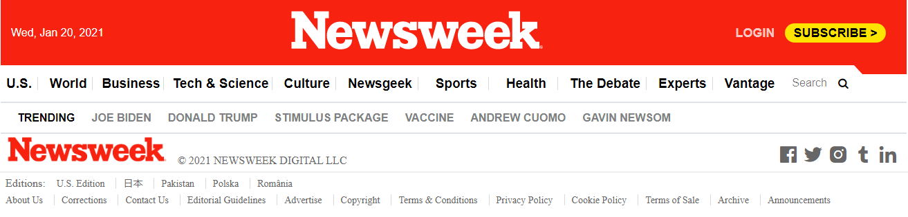
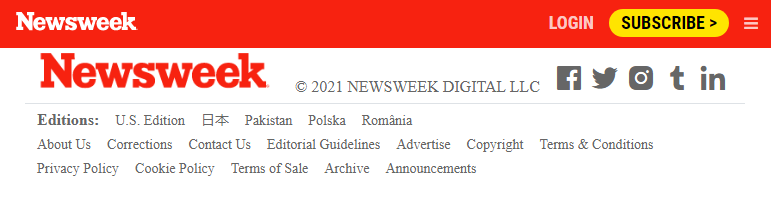
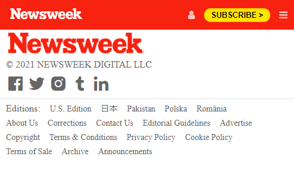

# Newsweek clone

> Newsweek clone Milestone 1 was created using Bootstrap.

In the next project we can see the header and footer of Newsweek website, we used bootstrap and a few lines of code in CSS to improve the default Bootstrap designs. 

## Built With 🔨

- HTML
- CSS
- Bootstrap
- Visual Studio Code
- Git and Github

## Live Demo

[Live Demo Link](https://livedemo.com)

### Install

To get a local copy up and running follow these simple example steps.
- Open terminal
- Clone this project by command git clone https://github.com/kensayo/NWK-wk3.git
- Cd NWK-wk3 folder
- Open index.html in browser

## Getting Started 

- Index.html is the main marke up that will show as the first page in the browser .
- In css folder you will find the css file that contain all applicated designing on this project .
- Img folder contain most of pictures that has been in use for this project

### Prerequisites

- IDE to edit and run the code (We've used Visual Studio Code 🔥).

### Usage

- For anyone who wants to practice responsive design using Bootstrap.

## Authors

👤 **Kenny Ortega**

- GitHub: [@kensayo](https://github.com/kensayo)
- Twitter: [@kensayo](https://twitter.com/kensayo)
- LinkedIn: [Kenny Ortega](https://www.linkedin.com/in/kenny-ortega-3580aa33/)

👤 **Dante Alonso**

- GitHub: [@DanteAlonsoHT](https://github.com/DanteAlonsoHT)
- Twitter: [@dante_dante1](https://twitter.com/dante_dante1)
- LinkedIn: [Dante Alonso](https://www.linkedin.com/in/dante-hernandez99/)

## 🤝 Contributing

Contributions, issues, and feature requests are welcome!

Feel free to check the [issues page](https://github.com/kensayo/NWK-wk3/issues).

## Show your support

Give a ⭐️ if you like this project!

## Acknowledgments

- Hat tip to anyone whose code was used 🔰
- Inspiration 💘
- Microverse program ⚡
- My standup team 🏹

## 📝 License

This project is [MIT](./mit.md) licensed.
